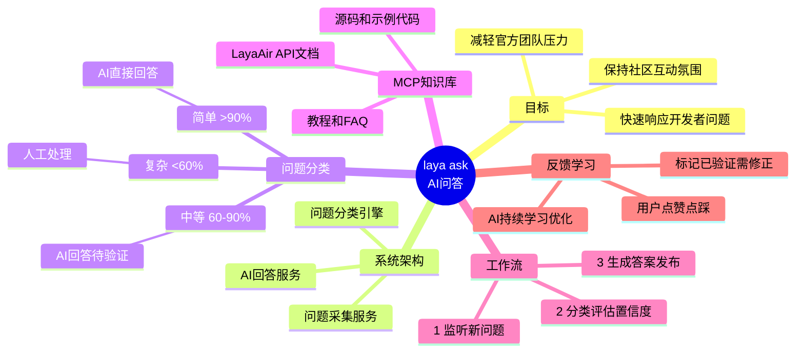

# 🤖 laya ask AI问答系统 - 解决方案

> 为 LayaAir 问答社区添加智能AI自动回复功能

[](https://opensource.org/licenses/MIT)
[](https://github.com/LayaBroccoli/Q-A-Community-Solution)
[](https://github.com/LayaBroccoli/Q-A-Community-Solution)

## 📋 项目概述

**目标**: 让 laya ask 问答社区具备AI自动回复能力，快速响应开发者问题，减轻官方团队压力，同时保持社区互动氛围。

**核心策略**: 混合模式 - 简单问题AI直接答，复杂问题人工处理

**当前状态**: 🎨 设计阶段（详见 [PROJECT.md](./PROJECT.md)）

---

## 🎯 设计亮点

### ✅ 响应快
- AI在5分钟内给出初步建议
- 不再让开发者干等

### ✅ 质量保
- 三重分类保险（关键词+特征+AI置信度）
- 人工最终把关，不会瞎回答

### ✅ 有温度
- 保持社区讨论氛围
- AI答案可被补充、修正

### ✅ 能进化
- 从用户反馈中学习
- 识别问题类型，持续优化

---

## 📁 文档导航

| 文档 | 说明 | 状态 |
|------|------|------|
| [项目说明](./PROJECT.md) | 当前状态和进展 | 🔄 实时更新 |
| [更新日志](./CHANGELOG.md) | 里程碑和实现记录 | 📅 详细记录 |
| [系统架构](./01-architecture.md) | 完整系统架构设计 | ✅ 完成 |
| [分类算法](./02-classification-algorithm.md) | 问题分类逻辑详解 | ✅ 完成 |
| [MCP集成](./03-mcp-integration.md) | 知识库查询方案 | ✅ 完成 |
| [实施计划](./04-implementation-plan.md) | 分阶段实施步骤 | ✅ 完成 |
| [思维导图](./mindmap.mermaid) | Mermaid思维导图 | ✅ 完成 |

---

## 🏗️ 系统架构

```
用户提问 → laya ask社区 → 问题采集服务 → 分类引擎
                                              ↓
                                  ┌─────────┴─────────┐
                              简单问题            复杂问题
                                  ↓                   ↓
                            AI直接回答             人工处理
                                  ↓                   ↓
                            发布+标记AI参考        通知官方
                                  ↓                   ↓
                            用户反馈循环 ─────────────┘
                                  ↓
                            AI学习优化
```

**详细架构图**: [01-architecture.md](./01-architecture.md)

---

## 🧠 问题分类策略

### 三重保险机制

1. **关键词匹配** - 快速识别API/BUG等类型
2. **特征分析** - 长度/代码/截图判断复杂度
3. **AI置信度评估** - LLM评估能否准确回答

### 分类结果

| 类型 | 置信度 | 处理方式 |
|------|--------|----------|
| 简单 | >90% | AI直接回答 |
| 中等 | 60-90% | AI回答+标记待验证 |
| 复杂 | <60% | 通知人工处理 |

**详细算法**: [02-classification-algorithm.md](./02-classification-algorithm.md)

---

## 🔧 MCP知识库集成

利用现有MCP服务器获取LayaAir相关知识：

- ✅ API参考文档
- ✅ 源码和示例代码  
- ✅ 教程和FAQ

**集成方案**: [03-mcp-integration.md](./03-mcp-integration.md)

---

## 🚀 实施计划

### 阶段1: 快速试水（1-2周）
- AI只回答简单明确的问题（API用法、配置项等）
- 答案先发草稿，人工审核后发布
- 验证MCP集成效果

### 阶段2: 训练优化（1个月）
- 收集人工答案，训练/微调模型
- AI开始回答更复杂的问题
- 引入用户反馈机制（点赞/点踩）

### 阶段3: 智能升级（持续）
- AI从历史问答中学习
- 自动识别问题类型，分发给不同"专家"
- 形成"问题-答案"知识图谱

**详细计划**: [04-implementation-plan.md](./04-implementation-plan.md)

---

## 💡 技术栈建议

- **问题采集**: Python/Node.js + webhook/定时轮询
- **AI模型**: GPT-4 / Claude 3.5 Sonnet（商业API）
- **知识库**: 现有MCP服务器
- **通知服务**: Telegram Bot / 钉钉机器人
- **数据库**: PostgreSQL（现有laya ask数据库）

---

## 📊 预期效果

| 指标 | 当前 | 目标 |
|------|------|------|
| 平均响应时间 | 数小时 | <5分钟 |
| 官方人工介入 | 每天20+ | 每天5-10 |
| 问题解决率 | 70% | 85%+ |

---

## 🎨 思维导图



在线查看: https://mermaid.live/

---

## 📝 License

MIT

---

## 🤝 贡献

欢迎提交Issue和PR！

---

**Created by**: 罐头 🥫  
**Date**: 2026-02-10
