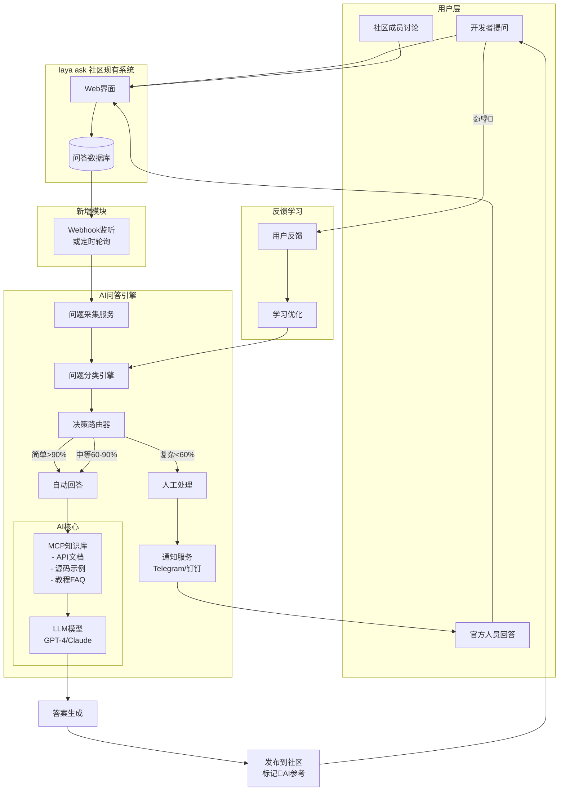
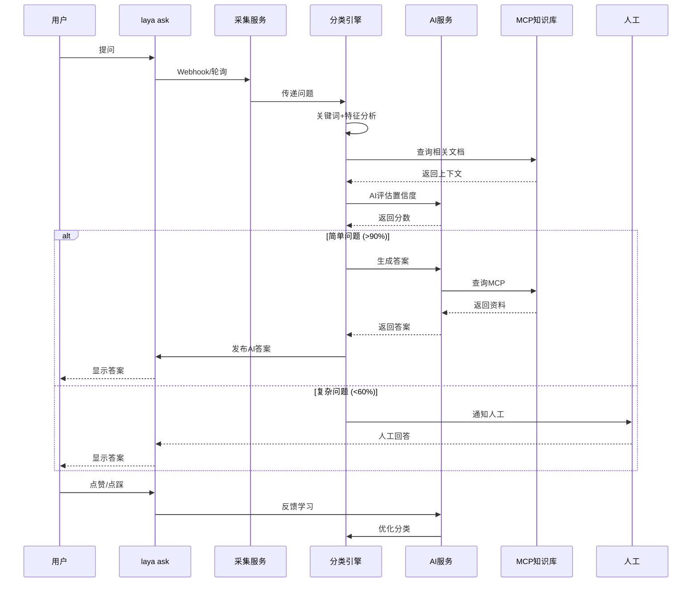

# 系统架构设计

## 完整架构图



---

## 核心组件详解

### 1️⃣ 问题采集服务 (Question Collector)

**职责**: 监听新问题并提取关键信息

**实现方式**:
```javascript
// 方案A: Webhook（推荐）
app.post('/webhook/new-question', async (req, res) => {
  const { title, content, category, tags, author } = req.body;
  
  await processQuestion({
    title,
    content,
    category,
    tags,
    author,
    timestamp: new Date(),
    url: req.body.url
  });
  
  res.json({ received: true });
});

// 方案B: 定时轮询
setInterval(async () => {
  const lastCheck = await getLastCheckTimestamp();
  const newQuestions = await fetchQuestions(lastCheck);
  
  for (const q of newQuestions) {
    await processQuestion(q);
  }
  
  await updateLastCheckTimestamp();
}, 60000); // 每分钟检查一次
```

**数据结构**:
```typescript
interface Question {
  id: string;
  title: string;
  content: string;
  category: string;
  tags: string[];
  author: string;
  timestamp: Date;
  url: string;
}
```

---

### 2️⃣ 问题分类引擎 (Classification Engine)

**职责**: 评估问题复杂度，决定处理方式

**三重分类机制**:

#### 第一层: 关键词匹配
```javascript
const KEYWORDS = {
  simple: ['api', '方法', '属性', '参数', '用法', '示例', '怎么用', '如何', '语法'],
  complex: ['bug', '报错', '崩溃', '卡死', '性能', '内存', '闪退', '不显示', '失效']
};

function keywordMatch(question) {
  const text = (question.title + ' ' + question.content).toLowerCase();
  
  const simpleCount = KEYWORDS.simple.filter(k => text.includes(k)).length;
  const complexCount = KEYWORDS.complex.filter(k => text.includes(k)).length;
  
  if (simpleCount > complexCount) return 'simple';
  if (complexCount > simpleCount) return 'complex';
  return 'medium';
}
```

#### 第二层: 特征分析
```javascript
function featureAnalysis(question) {
  let score = 0;
  const text = question.title + ' ' + question.content;
  
  // 长度分析
  if (text.length > 50) score -= 10;
  if (text.length > 100) score -= 10;
  
  // 代码块
  if (text.includes('```')) score -= 15;
  
  // 截图/日志
  if (text.includes('截图') || text.includes('日志')) score -= 10;
  
  // 堆栈信息
  if (text.includes('Error:') || text.includes('at ')) score -= 20;
  
  return score; // -50 to +50
}
```

#### 第三层: AI置信度评估
```javascript
async function aiConfidence(question, mcpContext) {
  const prompt = `
你是LayaAir技术专家。评估你能否准确回答以下问题：

问题标题: ${question.title}
问题内容: ${question.content}

可用参考资料:
${mcpContext}

评分标准:
- 90-100%: 非常有把握，文档中有明确答案
- 60-90%: 有把握，但可能需要补充说明
- <60%: 没把握，需要人工处理

只返回一个数字(0-100)，不要其他内容。
`;

  const confidence = await llmCall(prompt);
  return parseInt(confidence);
}
```

**综合决策**:
```javascript
async function routeQuestion(question) {
  const keywordResult = keywordMatch(question);
  const featureScore = featureAnalysis(question);
  const mcpContext = await mcpQuery(question);
  const aiConf = await aiConfidence(question, mcpContext);
  
  // 混合打分
  const finalScore = aiConf + featureScore;
  
  if (finalScore >= 90) return 'auto';
  if (finalScore >= 60) return 'semi-auto';
  return 'manual';
}
```

---

### 3️⃣ AI回答服务 (AI Answer Service)

**职责**: 基于MCP知识库生成答案

**工作流程**:
```javascript
async function generateAnswer(question) {
  // 1. 查询MCP知识库
  const context = await mcpQuery(question);
  
  // 2. 构建提示词
  const prompt = `
你是LayaAir官方技术支持，请回答以下开发者问题：

问题: ${question.title}
${question.content}

参考资料:
${context}

要求:
1. 直接回答问题，不要说废话
2. 如果有代码示例，提供完整可运行的代码
3. 格式清晰，使用markdown
4. 如果不确定，明确说明

回答:
`;

  // 3. 调用LLM生成答案
  const answer = await llmCall(prompt);
  
  // 4. 返回答案
  return {
    content: answer,
    source: 'ai',
    confidence: context.match_score,
    references: context.sources
  };
}
```

**答案发布**:
```javascript
async function publishAnswer(questionId, answer, mode) {
  const payload = {
    question_id: questionId,
    content: answer.content,
    // 标记为AI答案
    metadata: {
      source: 'ai',
      model: 'gpt-4',
      timestamp: new Date(),
      verified: mode === 'auto' // auto模式直接标记已验证
    }
  };
  
  // 发布到laya ask
  await api.post('/answers', payload);
  
  // 如果是半自动模式，通知人工审核
  if (mode === 'semi-auto') {
    await notifyHuman({
      type: 'review_needed',
      questionId,
      answer: answer.content,
      url: `https://ask.layabox.com/question/${questionId}`
    });
  }
}
```

---

### 4️⃣ 人工通知服务 (Human Notification Service)

**职责**: 复杂问题通知官方人员

**通知渠道**:
```javascript
async function notifyHuman(notification) {
  // Telegram Bot
  if (config.telegram.enabled) {
    await telegram.sendMessage({
      chat_id: config.telegram.chat_id,
      text: `
🤖 <b>AI需要人工帮助</b>

问题: ${notification.question.title}
链接: ${notification.url}

原因: ${notification.reason}
`,
      parse_mode: 'HTML'
    });
  }
  
  // 钉钉机器人
  if (config.dingtalk.enabled) {
    await dingtalk.send({
      msgtype: 'markdown',
      markdown: {
        title: 'laya ask AI - 需要人工处理',
        text: `
## 🤖 AI需要人工帮助

**问题**: ${notification.question.title}
**链接**: [查看详情](${notification.url})

**原因**: ${notification.reason}
        `
      }
    });
  }
}
```

---

### 5️⃣ 反馈学习系统 (Feedback Learning System)

**职责**: 从用户反馈中学习优化

**反馈收集**:
```javascript
// 在答案下方添加反馈按钮
<div class="feedback-buttons">
  <button onclick="feedback('👍')">👍 有帮助</button>
  <button onclick="feedback('👎')">👎 没用</button>
  <button onclick="feedback('💬')">💬 需补充</button>
</div>

// 处理反馈
app.post('/feedback', async (req, res) => {
  const { answerId, type, comment } = req.body;
  
  await saveFeedback({
    answerId,
    type, // 'upvote', 'downvote', 'comment'
    comment,
    timestamp: new Date()
  });
  
  // 如果是负面反馈，通知人工
  if (type === 'downvote') {
    await notifyHuman({
      type: 'bad_answer',
      answerId,
      reason: comment
    });
  }
  
  res.json({ received: true });
});
```

**学习优化**:
```javascript
// 每天分析反馈，优化分类算法
async function dailyLearning() {
  const yesterday = new Date(Date.now() - 86400000);
  
  // 获取昨天的反馈
  const feedbacks = await getFeedbacks(yesterday);
  
  // 统计AI答案的准确率
  const stats = {
    total: feedbacks.length,
    upvotes: feedbacks.filter(f => f.type === 'upvote').length,
    downvotes: feedbacks.filter(f => f.type === 'downvote').length
  };
  
  const accuracy = stats.upvotes / stats.total;
  
  console.log(`AI准确率: ${(accuracy * 100).toFixed(1)}%`);
  
  // 如果准确率下降，调整阈值
  if (accuracy < 0.7) {
    console.log('准确率下降，提高自动回答阈值');
    config.autoThreshold += 5;
  }
}
```

---

## 数据流图



---

## 技术选型

| 组件 | 推荐技术 | 备注 |
|------|----------|------|
| 采集服务 | Node.js/Python | webhook或定时任务 |
| 分类引擎 | Node.js | 规则+LLM混合 |
| AI模型 | GPT-4 / Claude 3.5 | 商业API，质量高 |
| MCP集成 | MCP Client | 标准MCP协议 |
| 通知服务 | Bot SDK | Telegram/钉钉 |
| 数据库 | PostgreSQL | 现有laya ask DB |

---

## 部署架构

```
┌─────────────────────────────────────────┐
│         Nginx / 反向代理                 │
└──────────────┬──────────────────────────┘
               │
       ┌───────┴────────┐
       ▼                ▼
┌──────────┐      ┌──────────┐
│ laya ask │      │ AI服务   │
│  现有系统 │      │  (新增)   │
└──────────┘      └──────────┘
       │                │
       └───────┬────────┘
               ▼
        ┌────────────┐
        │ PostgreSQL │
        │   数据库    │
        └────────────┘
```

---

## 监控指标

- ✅ 问题采集成功率
- ✅ 分类准确率
- ✅ AI答案好评率
- ✅ 平均响应时间
- ✅ 人工介入率

---

**下一步**: [分类算法详解](./02-classification-algorithm.md)
