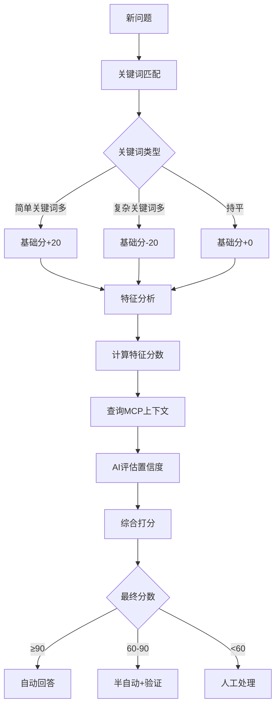

# 问题分类算法详解

## 核心思路

问题分类是整个系统的核心，决定了一个问题是由AI自动回答还是需要人工处理。我们采用**三重保险机制**确保分类准确：

1. **关键词匹配** - 快速初步判断
2. **特征分析** - 基于问题特征评分
3. **AI置信度评估** - LLM评估能否准确回答

---

## 算法流程图



---

## 第一层: 关键词匹配

### 规则定义

```javascript
const CLASSIFICATION_RULES = {
  // 简单问题关键词
  simple: {
    keywords: [
      'api', 'API', '方法', '函数', '属性', '参数',
      '用法', '示例', '怎么用', '如何', '语法',
      '配置', '设置', '文档', '教程'
    ],
    weight: 20 // 基础分+20
  },
  
  // 复杂问题关键词
  complex: {
    keywords: [
      'bug', 'BUG', '报错', '错误', '崩溃', 'crash',
      '卡死', '卡顿', '性能', '内存', '泄漏',
      '闪退', '不显示', '失效', '无效', '异常',
      '冲突', '兼容', '版本', '升级'
    ],
    weight: -20 // 基础分-20
  }
};
```

### 匹配算法

```javascript
function keywordMatch(question) {
  const text = (question.title + ' ' + question.content).toLowerCase();
  
  let simpleScore = 0;
  let complexScore = 0;
  
  // 统计简单关键词出现次数
  CLASSIFICATION_RULES.simple.keywords.forEach(keyword => {
    const regex = new RegExp(keyword, 'gi');
    const matches = text.match(regex);
    if (matches) {
      simpleScore += matches.length;
    }
  });
  
  // 统计复杂关键词出现次数
  CLASSIFICATION_RULES.complex.keywords.forEach(keyword => {
    const regex = new RegExp(keyword, 'gi');
    const matches = text.match(regex);
    if (matches) {
      complexScore += matches.length;
    }
  });
  
  // 计算基础分
  if (simpleScore > complexScore) {
    return { type: 'simple', score: 50 + CLASSIFICATION_RULES.simple.weight };
  } else if (complexScore > simpleScore) {
    return { type: 'complex', score: 50 + CLASSIFICATION_RULES.complex.weight };
  } else {
    return { type: 'medium', score: 50 }; // 持平时给中性分
  }
}
```

---

## 第二层: 特征分析

### 特征定义

| 特征 | 检测方式 | 扣分 | 说明 |
|------|----------|------|------|
| 问题长度 | >50字符 | -10 | 长问题通常复杂 |
| 问题长度 | >100字符 | -10 | 非常长的问题 |
| 包含代码块 | 检测 ` ``` ` | -15 | 需要调试代码 |
| 包含截图 | "截图"、"图片" | -10 | 需要看图分析 |
| 包含日志 | "日志"、"log" | -10 | 需要分析日志 |
| 包含堆栈 | "Error:"、"at " | -20 | 有异常堆栈 |
| 多个问题 | "还有"、"另外" | -5 | 一次问多个 |
| 标点符号 | 很少标点 | +5 | 可能是简单问题 |

### 算法实现

```javascript
function featureAnalysis(question) {
  const text = question.title + ' ' + question.content;
  let score = 0; // 从0开始，正分=简单，负分=复杂
  
  // 1. 长度分析
  if (text.length > 50) score -= 10;
  if (text.length > 100) score -= 10;
  
  // 2. 代码块检测
  const codeBlockCount = (text.match(/```/g) || []).length;
  if (codeBlockCount > 0) {
    score -= 15 * Math.ceil(codeBlockCount / 2); // 每2个```算一个代码块
  }
  
  // 3. 截图/图片
  if (text.includes('截图') || text.includes('图片') || text.includes('screenshot')) {
    score -= 10;
  }
  
  // 4. 日志
  if (text.includes('日志') || text.includes('log')) {
    score -= 10;
  }
  
  // 5. 堆栈信息
  if (text.includes('Error:') || text.includes('at ') || text.includes('Exception')) {
    score -= 20;
  }
  
  // 6. 多个问题
  if (text.includes('还有') || text.includes('另外') || text.includes('此外')) {
    score -= 5;
  }
  
  // 7. 标点符号（极少标点可能是简单问题）
  const punctuationCount = (text.match(/[，。！？、；：,.?!;:]/g) || []).length;
  if (punctuationCount < 2 && text.length > 20) {
    score += 5;
  }
  
  // 限制分数范围 -50 到 +50
  return Math.max(-50, Math.min(50, score));
}
```

---

## 第三层: AI置信度评估

这是最关键的一层，利用LLM的推理能力评估能否准确回答。

### Prompt设计

```javascript
async function aiConfidenceEvaluation(question, mcpContext) {
  const prompt = `
# 角色
你是LayaAir官方技术专家，具有丰富的问题诊断和解答经验。

# 任务
评估你能否准确回答以下开发者问题。请基于提供的参考资料进行判断。

# 问题
标题: ${question.title}
内容: ${question.content}
分类: ${question.category}
标签: ${question.tags.join(', ')}

# 参考资料
${mcpContext}

# 评分标准
- **90-100分**: 文档中有明确答案，可以直接准确回答
- **70-89分**: 文档中有相关内容，可以给出有价值的答案但可能需要补充
- **50-69分**: 文档内容有限，只能给出建议或排查方向
- **30-49分**: 文档中几乎找不到相关信息，只能给出一般性建议
- **0-29分**: 完全没有相关信息，无法给出有价值答案

# 特殊情况处理
- 如果是BUG报告，即使文档中没有明确说明，可以给60-70分（可以给出排查建议）
- 如果是性能问题，可以给50-60分（可以给出优化方向）
- 如果涉及第三方库或平台问题，给0-40分（超出LayaAir范围）

# 输出要求
只输出一个0-100的数字，不要有任何其他文字。

置信度分数:`;

  const response = await llmCall({
    model: 'gpt-4',
    prompt,
    temperature: 0.1, // 低温度保证稳定
    maxTokens: 5 // 只需要返回数字
  });
  
  const confidence = parseInt(response.trim());
  return isNaN(confidence) ? 50 : confidence;
}
```

### MCP上下文查询

```javascript
async function queryMCP(question) {
  // 提取问题关键词
  const keywords = extractKeywords(question.title + ' ' + question.content);
  
  // 调用MCP服务器查询相关文档
  const results = await mcpClient.search({
    query: keywords.join(' '),
    limit: 5,
    categories: ['api', 'tutorial', 'faq']
  });
  
  // 构建上下文
  const context = results.map(r => `
## ${r.title}
${r.snippet}
来源: ${r.url}
`).join('\n');
  
  return {
    context,
    matchScore: results.length > 0 ? 80 : 20, // 有匹配给高分
    sources: results.map(r => r.url)
  };
}
```

---

## 综合决策算法

### 分数计算

```javascript
async function finalDecision(question) {
  // 1. 关键词匹配 (0-100)
  const keywordResult = keywordMatch(question);
  
  // 2. 特征分析 (-50 to +50)
  const featureScore = featureAnalysis(question);
  
  // 3. MCP上下文查询
  const mcpResult = await queryMCP(question);
  
  // 4. AI置信度评估 (0-100)
  const aiConfidence = await aiConfidenceEvaluation(question, mcpResult.context);
  
  // 5. 综合打分
  // 关键词分数 30% + 特征分数 20% + AI置信度 50%
  const finalScore = Math.round(
    keywordResult.score * 0.3 +
    (featureScore + 50) * 0.2 + // 特征分数转换到0-100
    aiConfidence * 0.5
  );
  
  // 6. 决策
  const decision = {
    score: finalScore,
    mode: finalScore >= 90 ? 'auto' : 
          finalScore >= 60 ? 'semi-auto' : 'manual',
    details: {
      keyword: keywordResult,
      feature: featureScore,
      ai: aiConfidence,
      mcp: mcpResult
    }
  };
  
  // 记录日志（用于后续优化）
  await logDecision(question, decision);
  
  return decision;
}
```

### 决策结果

| 分数范围 | 模式 | 处理方式 | 标记 |
|---------|------|---------|-----|
| ≥90 | auto | AI直接回答 | ✅ 已验证 |
| 60-89 | semi-auto | AI回答+待验证 | ⏳ 待验证 |
| <60 | manual | 通知人工 | 👤 人工处理 |

---

## 学习与优化

### 每日分析

```javascript
async function dailyAnalysis() {
  const yesterday = new Date(Date.now() - 86400000);
  
  // 1. 获取昨天的所有决策和反馈
  const decisions = await getDecisions(yesterday);
  
  // 2. 统计各类模式的准确率
  const stats = {
    auto: { total: 0, upvoted: 0, downvoted: 0 },
    semiAuto: { total: 0, upvoted: 0, downvoted: 0 },
    manual: { total: 0 }
  };
  
  for (const decision of decisions) {
    const feedback = await getFeedback(decision.questionId);
    
    if (decision.mode === 'auto') {
      stats.auto.total++;
      if (feedback.type === 'upvote') stats.auto.upvoted++;
      if (feedback.type === 'downvote') stats.auto.downvoted++;
    } else if (decision.mode === 'semi-auto') {
      stats.semiAuto.total++;
      if (feedback.type === 'upvote') stats.semiAuto.upvoted++;
      if (feedback.type === 'downvote') stats.semiAuto.downvoted++;
    } else {
      stats.manual.total++;
    }
  }
  
  // 3. 计算准确率
  const autoAccuracy = stats.auto.upvoted / stats.auto.total;
  const semiAutoAccuracy = stats.semiAuto.upvoted / stats.semiAuto.total;
  
  console.log(`自动回答准确率: ${(autoAccuracy * 100).toFixed(1)}%`);
  console.log(`半自动准确率: ${(semiAutoAccuracy * 100).toFixed(1)}%`);
  
  // 4. 动态调整阈值
  if (autoAccuracy < 0.8) {
    console.log('⚠️ 自动回答准确率低，提高阈值');
    config.thresholds.auto += 5;
  } else if (autoAccuracy > 0.95) {
    console.log('✅ 自动回答准确率高，降低阈值');
    config.thresholds.auto -= 5;
  }
  
  // 保存分析结果
  await saveDailyStats(yesterday, { stats, accuracy: { auto: autoAccuracy, semiAuto: semiAutoAccuracy } });
}
```

### A/B测试

```javascript
// 对于边界情况（分数55-65），随机分配处理方式
async function borderlineABTest(question) {
  const decision = await finalDecision(question);
  
  // 如果分数在边界区域，随机选择模式
  if (decision.score >= 55 && decision.score <= 65) {
    const randomMode = Math.random() > 0.5 ? 'auto' : 'manual';
    
    await logABTest({
      questionId: question.id,
      score: decision.score,
      assignedMode: randomMode,
      timestamp: new Date()
    });
    
    return randomMode;
  }
  
  return decision.mode;
}
```

---

## 示例案例分析

### 案例1: 简单API问题

**问题**:
> 标题: LayaAir3中怎么获取Sprite的宽度？
> 内容: 我想获取一个Sprite对象的实际宽度，应该用什么属性？

**分析过程**:
1. 关键词: "怎么"、"属性" → 简单关键词 → 基础分70
2. 特征: 长度短，无代码/截图 → +5分
3. MCP: 查到 `Sprite.width` 文档 → 匹配度高
4. AI: 文档明确 → 95分

**最终**: 70×0.3 + 55×0.2 + 95×0.5 = **85分** → 半自动

---

### 案例2: 复杂BUG

**问题**:
> 标题: LayaAir3打包iOS后闪退
> 内容: 
> ```
> Error: undefined is not an object
> at HelloWorld.ts:25:15
> ```
> 开发工具正常运行，打包iOS就闪退了

**分析过程**:
1. 关键词: "闪退"、"Error" → 复杂关键词 → 基础分30
2. 特征: 有代码块、堆栈、长度适中 → -45分
3. MCP: 查到相关文档但不确定 → 匹配度低
4. AI: 需要调试信息 → 40分

**最终**: 30×0.3 + 5×0.2 + 40×0.5 = **31分** → 人工处理

---

## 配置参数

```javascript
const config = {
  thresholds: {
    auto: 90,      // ≥90 自动回答
    semiAuto: 60   // ≥60 半自动
  },
  
  weights: {
    keyword: 0.3,   // 关键词权重30%
    feature: 0.2,   // 特征权重20%
    ai: 0.5         // AI权重50%
  },
  
  mcp: {
    maxResults: 5,  // 最多返回5条相关文档
    minRelevance: 0.6  // 最低相关度
  }
};
```

---

**下一步**: [MCP集成方案](./03-mcp-integration.md)
